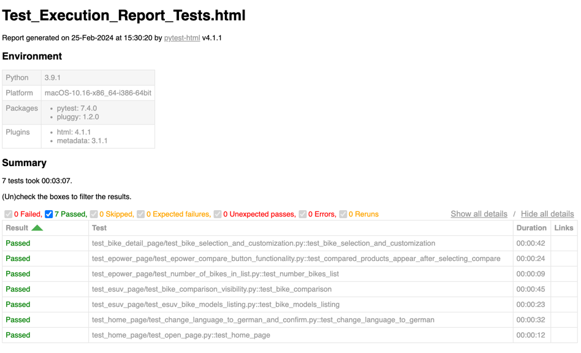

# Automated Test Suite for Greyp Bikes Website

This repository contains automated tests for the Greyp Bikes website. The tests are written in Python using the Selenium WebDriver.

## Getting Started

These instructions will get you a copy of the project up and running on your local machine for testing purposes.

### Prerequisites

- Python 3.8 or higher
- pip (Python package installer)

### Installing

1. Clone the repository to your local machine.
2. Navigate to the project directory.
3. Install the required dependencies using pip:

```bash
pip install -r requirements.txt
```

## Directory Structure

 1. **pages**: This directory contains page object models for different pages of the website. Each page
has its own class with methods representing the actions that can be performed on that page.

```bash
class EPowerPage:
    ...
```

 2. **tests**: This directory contains the actual test cases. They are organized into subdirectories based
on the page or functionality they are testing.

```bash
def test_bike_selection_and_customization(driver, epower_url):
    ...
```

 3. **utils**: This directory contains utility code, such as locator definitions.

```bash
class EPower:
    ...
```

 4. **conftest.py**: This file contains setup code for the test suite, including the automatic installation
and launching of ChromeDriver using the **chromedriver-autoinstaller** library.

```bash
@pytest.fixture
def driver():
    ...
```

## Running the tests

To run all tests, navigate to the project directory and run the following command:

```bash
pytest -vs tests/
```

or

if you want to run tests for specific page run the following command:

```bash
pytest -vs tests/test_home_page
```

After the tests are executed, a HTML report will be generated in the results/ directory using the pytest-html library.



### Chromedriver Autoinstaller
The tests user the chromedriver-autoinstaller library to automatically download and install the latest version of ChromeDriver that is compatible
with the installed version of Google Chrome. The ChromeDriver is launched via the conftest.py file.

### Headless mode
All tests are executed in headless mode, meaning they run in the background without displaying a GUI. This makes the tests
faster and allows them to be run in environments without a graphical display.

## Continuous Integration
The tests are also set up to run automatically via GitHub Actions after each push to the main branch.